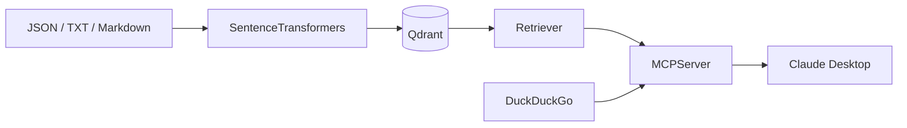

# Personal Database MCP Server

Personal Database MCP Server is an MCP server for semantically searching a personal
document collection. It converts documents into embeddings, stores them in Qdrant, and
exposes tools, resources, and prompt templates to MCP clients such as Claude Desktop and
Codex.

The project is currently designed as a local demo: Qdrant runs in Docker, the MCP server
uses Streamable HTTP at `http://127.0.0.1:2545/mcp`, and the embedding model runs directly
on the host machine.

## Features

- Search for relevant documents in Qdrant using cosine similarity.
- Search the Internet through DuckDuckGo when the database does not contain enough
  information.
- Add new documents to local storage and Qdrant through an MCP tool.
- Read topic lists and document contents through MCP resources.
- Provide prompt templates for RAG, Internet search, and document-ingestion workflows.
- Connect to Claude Desktop and Codex through MCP Streamable HTTP.

## Architecture



Current defaults:

| Component | Value |
| --- | --- |
| Embedding model | `BAAI/bge-large-en-v1.5` |
| Vector dimension | `1024` |
| Distance metric | Cosine |
| Qdrant URL | `http://localhost:6333` |
| Collection | `mcp_database` |
| MCP endpoint | `http://127.0.0.1:2545/mcp` |
| Document directory | `./documents` |

## Requirements

- Python `>= 3.13`.
- [uv](https://docs.astral.sh/uv/) for dependency and environment management.
- Docker or Docker Desktop for running Qdrant.
- Node.js/npm only when integrating Claude Desktop through `mcp-remote`.
- Enough disk space for the embedding model, Hugging Face cache, documents, and Qdrant
  data.

The `BAAI/bge-large-en-v1.5` model has a weight file of approximately 1.3 GB. It can run
on a CPU, but embedding generation may take a long time. PyTorch will use a GPU when a
compatible CUDA-enabled environment is available.

## Installation

Clone the repository and synchronize the environment from the lockfile:

```powershell
git clone https://github.com/ngocthinh09/Personal-Database-MCP-Server.git
cd Personal-Database-MCP-Server
uv sync --locked
```

`requirements.txt` is a snapshot from a Windows environment and contains Windows-only
dependencies such as `pywin32`; do not use it unchanged to provision a Linux server. For
this project, `uv sync --locked` is recommended because `uv.lock` provides a more complete
and reproducible cross-platform environment definition.

## 1. Run Qdrant

The following command creates a container and named volume so the data survives container
restarts:

```powershell
docker run -d --name personal-database-qdrant -p 6333:6333 -p 6334:6334 -v qdrant_storage:/qdrant/storage qdrant/qdrant
```

If the container already exists:

```powershell
docker start personal-database-qdrant
```

Verify the REST API:

```powershell
curl.exe http://localhost:6333/collections
```

The Qdrant Dashboard is available at
[http://localhost:6333/dashboard](http://localhost:6333/dashboard). Port `6333` serves the
REST API and Web UI, while port `6334` serves gRPC.

## 2. Prepare Documents

### Use the sample datasets

The following script downloads 26 `burgerbee/*` datasets from Hugging Face and writes
each sample to `documents/<topic>/*.json`:

```powershell
uv run python src/personal_database_mcp_server/prepare_document.py
```

This process downloads and writes many documents, so it may take considerable time and
disk space.

### Use your own documents

Create at least one topic directory inside `documents/`, for example:

```text
documents/
└── chemistry/
    ├── organic-chemistry.txt
    ├── periodic-table.md
    └── lesson.json
```

The project accepts `.txt`, `.md`, and `.json` files. A JSON file must contain a `text`
field; `source`, `split`, and `id` are optional:

```json
{
  "text": "Organic chemistry studies carbon-containing compounds.",
  "source": "personal-note",
  "split": "chemistry",
  "id": "chemistry-001"
}
```

The `documents/` directory must exist before the MCP server starts.

## 3. Build the Vector Database

Make sure Qdrant is running, then execute:

```powershell
uv run python src/personal_database_mcp_server/create_vector_database.py
```

The script will:

1. Read every `.json`, `.txt`, and `.md` file under `documents/`.
2. Generate normalized embeddings with `BAAI/bge-large-en-v1.5` using a batch size of
   `16`.
3. Create the `mcp_database` collection with 1024-dimensional vectors and cosine
   distance.
4. Upload the vectors and their payloads to Qdrant.
5. Run an example query about organic chemistry.

The script calls `create_collection`, so it will fail when `mcp_database` already exists.
Only delete the existing collection or change its name when you intentionally want to
rebuild the database. Back up important data before deleting a collection.

> The embedding model used for querying must be exactly the same as the model used for
> indexing. Two models may both produce 1024-dimensional vectors while using entirely
> different embedding spaces. If an existing collection was built with Jina v3, either
> continue querying it with Jina v3 or rebuild it with BGE Large before using the current
> retriever.

## 4. Run the MCP Server

```powershell
uv run python src/personal_database_mcp_server/main.py
```

Keep this terminal open. The first startup may take additional time while the embedding
model is downloaded and loaded. Once startup is complete, the MCP endpoint is:

```text
http://127.0.0.1:2545/mcp
```

This is an MCP Streamable HTTP endpoint, not a conventional REST endpoint. Receiving a
`Missing session ID` response after opening `GET /mcp` in a browser or with `curl` does
not mean the server is broken; an MCP client must complete the `initialize` handshake
first.

## MCP Capabilities

### Tools

| Tool | Purpose |
| --- | --- |
| `retrieve_documents_from_database` | Embed a query and retrieve the nearest documents from Qdrant. |
| `search_query_on_internet` | Search DuckDuckGo and return result titles and snippets. |
| `add_document_to_database` | Write a document to `documents/<topic>/` and upsert its embedding into Qdrant. |

Example requests for an MCP client:

```text
Find five documents in Personal Database related to organic chemistry and summarize them.
```

```text
If the database does not contain recent information about Donald Trump, use the Internet search tool.
```

```text
Add the following note to the chemistry topic under the name carbon-note: ...
```

### Resources

| Resource URI | Content |
| --- | --- |
| `document://topics` | List of all topics. |
| `document://topics/{topic_name}` | Every document in a topic. |
| `document://topics/{topic_name}/pages/{page_number}` | Paginated topic documents, 10 documents per page; pages start at 1. |

The resource index is created when the server starts. A newly added document is available
to vector search immediately, but restart the server before expecting the resource index
to include new files or topics.

### Prompts

- `retrieve_documents_from_database_prompt`
- `retrieve_document_and_search_internet_prompt`
- `search_query_on_internet_prompt`
- `add_single_document_to_database_prompt`

Prompt and resource discovery depends on the MCP client. For automated workflows, refer
to tools by their exact names in your request.

Some prompt text still refers to old tool names. The valid tool names are
`search_query_on_internet` and `add_document_to_database`; prefer these names when writing
requests or testing prompt templates.

## Claude Desktop Integration

The server currently uses Streamable HTTP, while Claude Desktop's traditional local
configuration launches child processes over stdio. The third-party `mcp-remote` package
can bridge stdio to HTTP.

1. Start the MCP server using the command in the previous section.
2. Open `%APPDATA%\Claude\claude_desktop_config.json` on Windows.
3. Add the following configuration:

```json
{
  "mcpServers": {
    "Personal Database MCP Server": {
      "command": "cmd",
      "args": [
        "/c",
        "npx",
        "-y",
        "mcp-remote",
        "http://127.0.0.1:2545/mcp"
      ]
    }
  }
}
```

4. Fully quit and reopen Claude Desktop.
5. Open `+` → `Connectors` to inspect the tools, resources, and prompts.

Notes:

- The root key must be `mcpServers` (plural).
- The URL must be a plain string, not Markdown syntax such as `[url](url)`.
- `npx -y` may download `mcp-remote` on its first run, so Node.js/npm and an Internet
  connection are required.
- `mcp-remote` is a third-party bridge, not an official Anthropic package.
- Do not add this localhost URL through **Add custom connector**. Remote connectors are
  called from Anthropic's infrastructure and cannot access `127.0.0.1` on your machine.
  To use the server from Claude web or mobile, deploy a publicly reachable HTTPS endpoint
  and add appropriate authentication.

Claude Desktop logs on Windows are normally available under `%APPDATA%\Claude\logs`.

## Codex Integration

Codex supports Streamable HTTP directly, so it does not require `mcp-remote`. While the
MCP server is running on the same machine, add it with Codex CLI:

```powershell
codex mcp add personal-database --url http://127.0.0.1:2545/mcp
codex mcp list
```

Alternatively, add it manually to `~/.codex/config.toml`:

```toml
[mcp_servers.personal_database]
url = "http://127.0.0.1:2545/mcp"
startup_timeout_sec = 20
tool_timeout_sec = 60
```

Restart Codex after changing the configuration. In the Codex TUI, use `/mcp` to inspect
active servers. `127.0.0.1` only works when Codex runs on the same machine; a cloud
session cannot access your localhost endpoint.

## Project Structure

```text
.
├── documents/                                  # Local corpus (gitignored)
├── qdrant_storage/                             # Qdrant bind-mount data (gitignored)
├── src/personal_database_mcp_server/
│   ├── main.py                                 # Current entry point
│   ├── server.py                               # MCP tools, resources, and prompts
│   ├── retriever.py                            # Embedding and Qdrant retrieval
│   ├── prepare_document.py                     # Dataset download and conversion
│   └── create_vector_database.py               # Qdrant indexing pipeline
├── pyproject.toml
├── requirements.txt
└── uv.lock
```

## Troubleshooting

### `MCPServer.__init__() got an unexpected keyword argument 'host'`

MCP SDK v2 does not accept `host` or `port` in the constructor. Pass them when starting
the server:

```python
mcp_server.run(transport="streamable-http", host="127.0.0.1", port=2545)
```

### `WinError 123 ... 'http:'`

The Qdrant URL was passed to `QdrantClient(path=...)`, causing Windows to interpret
`http:` as a directory name. Use:

```python
QdrantClient(url="http://localhost:6333")
```

### Qdrant reports an invalid vector dimension

Check the query model, the model used for indexing, and the collection's vector size. The
current configuration requires a dimension of `1024`; matching dimensions alone do not
guarantee that two models share a compatible embedding space.

### Claude or Codex cannot connect

- Confirm that both Qdrant and the Python MCP server are still running.
- Verify the endpoint is exactly `http://127.0.0.1:2545/mcp`.
- Restart the client after changing its configuration.
- For Claude Desktop, check Node/npm, `mcp-remote`, and the Desktop logs.
- For Codex, run `codex mcp list` or use `/mcp`.

## Security and Current Limitations

- The server binds only to `127.0.0.1` and does not implement authentication or TLS.
- The document-ingestion tool can write to the filesystem and Qdrant; only use it with
  trusted clients.
- Do not expose port `2545` or Qdrant port `6333` directly to the Internet.
- Topic and document names are currently used as path components. Do not accept untrusted
  input before adding appropriate validation.
- The indexing pipeline holds the corpus and its embeddings in memory. Test with a small
  dataset before indexing a large corpus.
- URLs, model IDs, collection names, and ports are currently hard-coded in the source.

## References

- [Model Context Protocol — Introduction](https://modelcontextprotocol.io/docs/getting-started/intro)
- [MCP Python SDK](https://github.com/modelcontextprotocol/python-sdk)
- [MCP Transports specification](https://modelcontextprotocol.io/specification/2025-06-18/basic/transports)
- [Qdrant local quickstart](https://qdrant.tech/documentation/quick-start/)
- [Qdrant collections](https://qdrant.tech/documentation/concepts/collections/)
- [uv project documentation](https://docs.astral.sh/uv/guides/projects/)
- [Sentence Transformers documentation](https://sbert.net/)
- [BAAI/bge-large-en-v1.5 model card](https://huggingface.co/BAAI/bge-large-en-v1.5)
- [Hugging Face Datasets documentation](https://huggingface.co/docs/datasets/)
- [Claude Desktop local MCP servers](https://support.claude.com/en/articles/10949351-getting-started-with-local-mcp-servers-on-claude-desktop)
- [Claude remote custom connectors](https://support.claude.com/en/articles/11175166-get-started-with-custom-connectors-using-remote-mcp)
- [Codex MCP documentation](https://learn.chatgpt.com/docs/extend/mcp)
- [`mcp-remote` on npm](https://www.npmjs.com/package/mcp-remote)
